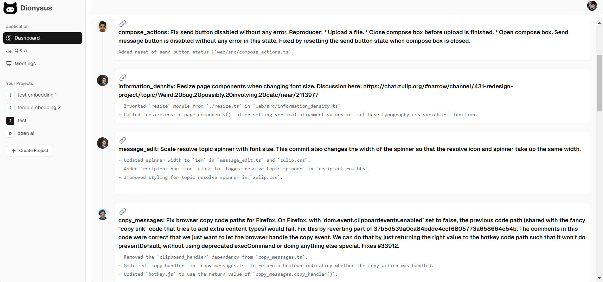

# Dionysus

## Overview
Dionysus is a powerful project management and collaboration platform that integrates AI-driven solutions to streamline workflow. It includes a dashboard, Q&A section, meeting management, and project creation features, making teamwork more efficient and productive.

## Features

### Dashboard
- Displays a **top commit summary** related to the project.
- **AI Ask a Question Card** (powered by Gemini API and vector embeddings of Gemini) allows users to:
  - Ask project-related questions.
  - Receive solutions with source code.
  - Save questions for future reference.
- **Create New Meeting Card** to schedule meetings.
- Upload a **meeting file**, and view its information inside the meeting page.

**Screenshot:** 

### Home page


### User Dashboard


### Project summary



### add new project
=


### Q&A Page
- Ask project-related questions powered by Gemini (ex - Which file should I edit to change Home page).
- View and manage saved questions for later reference.

**Screenshot:** 

### AI power ask-question card


### Answer Page


### Saved Question


### Saved Answer


### Meeting Page
- Upload meeting files, which utilize **Assembly AI** to:
  - Summarize the issues discussed in the meeting.
  - Generate meeting summaries.
  - View further details by clicking on the generated summary.

**Screenshot:**  

### Create new meeting


### Meeting issue summary 


### Meeting issue in detail


### Authentication & Collaboration
- User authentication is handled by **Clerk** (Sign in/Sign up).
- **Add Member Button** allows users to add team members to their projects.

**Screenshot:**  

### Invite members


## Tech Stack
- **Framework:** Next.js (T3 Stack)
- **Database:** Prisma ORM, NeonDB
- **Languages:** TypeScript
- **UI & Styling:** TailwindCSS, ShadCN, Lucide React
- **AI & NLP:** Google AI Gemini, Assembly AI, LangChain
- **File Storage:** Cloudinary
- **React Components & Utilities:** React Components, Toast, Zod

## Installation & Setup
1. Clone the repository:
   ```sh
   git clone https://github.com/bhanusingh10/dionysus.git
   ```
2. Install dependencies:
   ```sh
   npm install
   ```
3. Set up environment variables in a `.env` file.
4. Run the project:
   ```sh
   npm run dev
   ```

## License
This project is licensed under the MIT License.
 
